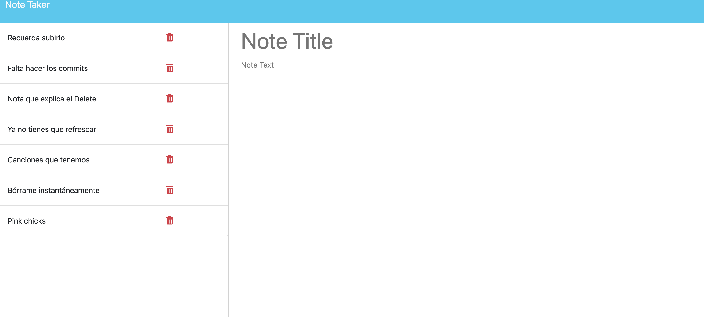

# Express note taker
by cidherp2

## Table of Contents

*[Description](#description)

*[Installation-instructions](#installation)

*[Usage](#usage)

*[License](#license)

*[Contribution](#contribution)

*[Tests](#test)

*[Questions](#questions)
* [License](#license)

## Description
This project is ment to help you write notes and save them and be able to access them, you can create new notes and delete old ones, all from the app 
## Installation-instructions
you just need to run "npm i" in case you are developing it, but in this case it´s already been deployed
## Usage
Just click in the centrer button on the home page, that will take you to the notes section, after that give a new note a title and start writting, after  you´re finished, just click on the save note button, if you want to read a note just click on it and   if you wanna delete click on the red trash can, if you want to create a new note after that, juts click on "create a new note" button at the top right corner.

## Screenshots

## License
ISC
## Contribution
There are no contribution guidlines foe this proyect at the momment.
## Tests
There are no tests fot this proyect
## Have any more questions?
You can reach me here
    Git Hub: cidherp2
    email: alexlarios70@hotmail.com
## License
        Licensed under the ISC license
